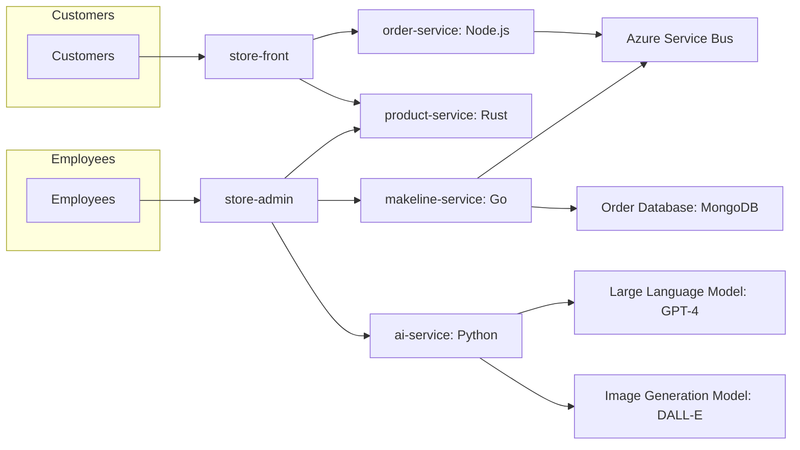

# Best Buy Cloud-Native Application

## Overview
Welcome to the Best Buy Cloud-Native Application repository. This project demonstrates a full-stack cloud-native solution built with microservices architecture, deployed on a Kubernetes cluster, and integrated with AI-powered features for product descriptions and image generation.

### Application Components
The Best Buy application includes the following microservices:

| **Service**       | **Description**                                                                           |
|--------------------|-------------------------------------------------------------------------------------------|
| **Store-Front**    | Customer-facing app for browsing products and placing orders.                            |
| **Store-Admin**    | Employee-facing app for managing products and viewing orders.                            |
| **Order-Service**  | Handles order creation and sends data to the managed order queue (Azure Service Bus).    |
| **Product-Service**| Manages CRUD operations for product data.                                                |
| **Makeline-Service**| Processes and completes orders by reading from the managed order queue.                 |
| **AI-Service**     | Generates AI-powered product descriptions and images using GPT-4 and DALL-E models.      |
| **Database**       | MongoDB for persisting order and product data.                                           |

---

## Application Architecture


This architecture diagram illustrates the interaction between microservices, Azure Service Bus, and MongoDB within the Kubernetes cluster.

---

## Features
- **Microservices Architecture**: Independently deployable services communicating over REST APIs.
- **Managed Backing Service**: Replaced RabbitMQ with Azure Service Bus for order queue management.
- **AI Integration**: Uses GPT-4 for generating product descriptions and DALL-E for generating product images.
- **Kubernetes Deployment**: Deployed on Azure Kubernetes Service (AKS) with ConfigMaps and Secrets for configuration management.

---

## Deployment Instructions

Follow these steps to deploy the application:

### Prerequisites
1. **Tools Required:**
   - Docker
   - Kubernetes CLI (`kubectl`)
   - Azure CLI
   - OpenAI API or Azure OpenAI Services access

2. **Azure Resources:**
   - Azure Kubernetes Service (AKS) cluster
   - Azure Service Bus
   - MongoDB deployment (via Kubernetes StatefulSet or Azure CosmosDB for MongoDB API)

### Steps
1. Clone this repository and navigate to the root directory:
   ```bash
   git clone <repository-link>
   cd best-buy-cloud-app
   ```

2. Build and Push Docker Images:
   ```bash
   docker build -t viphan/store-front ./store-front
   docker push viphan/store-front
   # Repeat for other services
   ```

3. Deploy Kubernetes Resources:
   ```bash
   kubectl apply -f ./Deployment-Files/store-front-deployment.yaml
   kubectl apply -f ./Deployment-Files/product-service-deployment.yaml
   # Repeat for other services
   ```

4. Verify Deployment:
   ```bash
   kubectl get pods
   kubectl get services
   ```

5. Access the Application:
   - Use the external IP of the Store-Front service to access the customer-facing app.
   - Use the external IP of the Store-Admin service to access the employee-facing app.

---

## Microservice Repositories

| Service | Repository Link |
|---------|-----------------|
| `store-front` | https://github.com/viphan123/store-front-L8 |
| `store-admin` | https://github.com/viphan123/store-admin-L8 |
| `order-service` | https://github.com/viphan123/order-service-L8 |
| `product-service` | https://github.com/viphan123/product-service-L8 |
| `makeline-service` | https://github.com/viphan123/makeline-service-L8 |
| `ai-service` | https://github.com/viphan123/ai-service-L8 |
| `virtual-customer` | https://github.com/viphan123/virtual-customer-L8 |
| `virtual-worker` | https://github.com/viphan123/virtual-worker-L8 |

---
Each service in the application is containerized and deployed to Docker Hub, with Kubernetes orchestrating their deployment and management. The store-front service serves as the primary entry point for customers, while the store-admin service is designed for employees to manage operations. The order-service handles order management and integrates with the message queue. The product-service manages product data, including inventory and CRUD operations. The makeline-service oversees the makeline process by processing orders from the queue. The ai-service integrates AI models to support the admin interface, providing features like AI-generated product descriptions and images. Additionally, the virtual-customer service simulates customer behavior, and the virtual-worker service simulates employee activities for testing and demonstration purposes.
## Docker Images

| **Service**       | **Docker Image Link**         |
|--------------------|-------------------------------|
| `store-front`      | https://hub.docker.com/r/viphan123/store-front      |
| `store-admin`      | https://hub.docker.com/r/viphan123/store-admin      |
| `order-service`    | https://hub.docker.com/r/viphan123/order-service    |
| `product-service`  | https://hub.docker.com/r/viphan123/product-service  |
| `makeline-service` | https://hub.docker.com/r/viphan123/makeline-service |
| `ai-service`       | https://hub.docker.com/r/viphan123/ai-service       |
| `virtual-customer` | https://hub.docker.com/r/viphan123/virtual-customer |
| `virtual-worker`   | https://hub.docker.com/r/viphan123/virtual-worker   |

---

